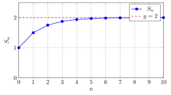

#+TITLE: Geometric Series
#+DATE: 2026-06-04
#+HUGO_DRAFT: false
#+SETUPFILE: setup-blog.org
#+bibliography: ~/Documents/library/catalog.bib

The geometric series is one of the most fundamental results in analysis, underpinning everything from probability generating functions to Fourier series.

* The closed form

#+begin_definition Geometric Series
A *geometric series* with ratio $r$ and first term $a$ is the sum
$$S_n = \sum_{k=0}^{n} a r^k = a + ar + ar^2 + \cdots + ar^n.$$
#+end_definition

#+begin_theorem Partial Sum Formula
For $r \neq 1$,
$$\sum_{k=0}^{n} r^k = \frac{1 - r^{n+1}}{1 - r}.$$
#+end_theorem

#+begin_proof
Let $S_n = \sum_{k=0}^{n} r^k$. Then $r S_n = \sum_{k=1}^{n+1} r^k$, so
$$S_n - r S_n = 1 - r^{n+1} \implies S_n = \frac{1 - r^{n+1}}{1-r}. \qquad \square$$
#+end_proof

* The infinite series

#+begin_corollary Infinite Geometric Series
If $|r| < 1$ then $\displaystyle\sum_{k=0}^{\infty} r^k = \frac{1}{1-r}$.
#+end_corollary

The rate of convergence is geometric: each term is $r$ times the previous. For $r = 1/2$:

$$S_n = 2\left(1 - \frac{1}{2^{n+1}}\right) \xrightarrow{n\to\infty} 2.$$

* Application: generating functions

The identity $(1-r)^{-1} = \sum r^k$ is the starting point for many generating function arguments. For instance, the number of ways to make change for $n$ cents using pennies satisfies a recurrence whose generating function is exactly a geometric series [cite:@Blitzstein_2019].

* Convergence plot

The following figure shows the partial sums $S_n$ for $r = 1/2$ approaching $2$:

#+CAPTION: Partial sums of $\sum (1/2)^k$ converging to 2.

